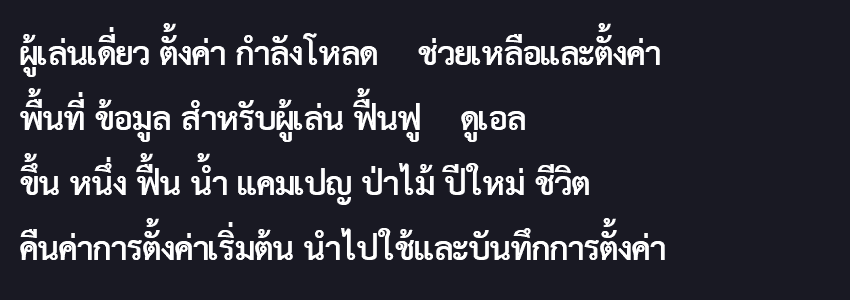
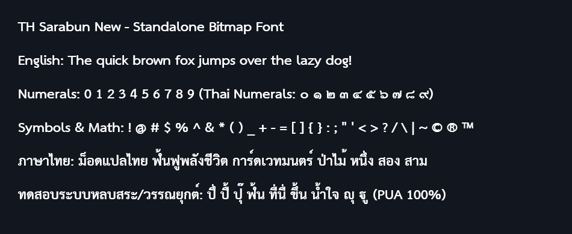
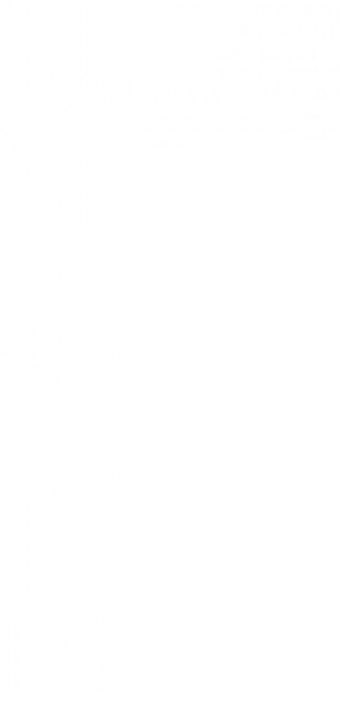
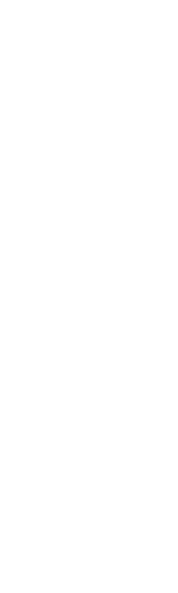

# Sarabun Bitmap Fonts Package (ชุดฟอนต์บิตแมปภาษาไทย Sarabun)

ชุดโฟลเดอร์นี้รวบรวมไฟล์ **Bitmap Font ภาษาไทย (TH Sarabun New)** ที่ถูกสร้างและปรับแต่งเป็นพิเศษสำหรับเกม *Yu-Gi-Oh! Legacy of the Duelist: Link Evolution* โดยแยกเก็บไว้อย่างเป็นสัดส่วนเพื่อความสะดวกในการสำรองข้อมูล นำไปใช้งาน หรือนำไปพัฒนาต่อยอดกับเกมอื่นๆ

---

## 📷 ตัวอย่างการแสดงผลภาษาไทย (In-Game / Engine Preview)

<p align="center">
  
  <br><em>ภาพตัวอย่าง: การแสดงผลข้อความภาษาไทยผ่านระบบ Bitmap Font พร้อมการจัดวางสระและวรรณยุกต์หลบอย่างถูกต้อง (PUA Shaping)</em>
</p>

> [!TIP]
> **จุดเด่นสำคัญ:** แสดงผลสระและวรรณยุกต์ซ้อนได้ถูกต้อง 100% (เช่น คำว่า *พื้นที่, ฟื้นฟู, หนึ่ง, ชีวิต, นำไปใช้*) โดยไม่มีปัญหาสระลอยหรือวรรณยุกต์ชนหางพยัญชนะ ด้วยระบบจัดวาง PUA Glyphs อัตโนมัติ

---

## 1. โครงสร้างโฟลเดอร์ (Directory Structure)

```text
sarabun_bitmap_fonts/
├── standalone_full_fonts/     # ชุด Bitmap Font เต็มรูปแบบ (อังกฤษ + เลข + สัญลักษณ์ + ไทย 100% ไม่ใช้ไฟล์เกม)
├── game_ready_fontbin/        # ไฟล์ Fontbin สำเร็จรูปสำหรับใส่เกม LOTD (.fbin + .png)
├── rendered_glyphs/           # Texture Sheet ตัวอักษรไทยล้วนที่เรนเดอร์จากฟอนต์ Sarabun พร้อม Metadata
├── ttf_sources/               # ไฟล์ฟอนต์ต้นฉบับ TrueType (.ttf)
├── tables_and_configs/        # ตารางแมปปิ้งตัวอักษร Unicode, PUA และการตั้งค่าขนาดฟอนต์
├── tools/                     # สคริปต์สำหรับเรนเดอร์และแพตช์ไฟล์ฟอนต์ทั้งหมด
├── docs/                      # ภาพตัวอย่างและเอกสารประกอบ (Images & Showcases)
└── README.md                  # เอกสารอธิบายการใช้งานชุดฟอนต์นี้
```

---

## 2. รายละเอียดของแต่ละโฟลเดอร์

### 📁 `standalone_full_fonts/` (ฟอนต์อิสระเต็มรูปแบบ 100% ไม่ใช้ไฟล์ของเกม)
รวบรวมชุด Bitmap Font ที่เรนเดอร์จากฟอนต์ **TH Sarabun New** โดยตรง 100% ครบทุกอักขระ (254 อักขระ: ภาษาอังกฤษ A-Z, a-z, เลขอารบิก 0-9, เลขไทย ๐-๙, สัญลักษณ์สากลทางคณิตศาสตร์และวรรคตอน และภาษาไทยครบทุกตัวพร้อมระบบ PUA หลบสระ) โดย**ไม่มีส่วนประกอบใดๆ ของเกม Yu-Gi-Oh!**:

<p align="center">
  
  <br><em>ภาพตัวอย่าง: ฟอนต์ TH Sarabun New ฉบับ Standalone แสดงผลภาษาอังกฤษ, ตัวเลข, สัญลักษณ์ และภาษาไทยพร้อมสระหลบครบวงจร</em>
</p>

* **ไฟล์ที่มีให้ใช้งาน (6 แบบมาตรฐาน):**
  * `sarabun_regular_24px.{png, fnt, json}`: สำหรับข้อความทั่วไปขนาดเล็ก
  * `sarabun_regular_32px.{png, fnt, json}`: สำหรับเนื้อเรื่อง ซับไตเติล และ UI ทั่วไป
  * `sarabun_regular_48px.{png, fnt, json}`: สำหรับจอความละเอียดสูง (Hi-DPI)
  * `sarabun_bold_24px.{png, fnt, json}`: ตัวหนาขนาดเล็ก
  * `sarabun_bold_32px.{png, fnt, json}`: ตัวหนาขนาดกลาง สำหรับชื่อเมนูและหัวข้อ
  * `sarabun_bold_48px.{png, fnt, json}`: ตัวหนาขนาดใหญ่ สำหรับชื่อการ์ดและประกาศสำคัญ
* **รูปแบบไฟล์ที่รองรับ:**
  * `.fnt`: มาตรฐาน **AngelCode BMFont** สากล สามารถนำไปลากใส่ Unity (TextMeshPro / NGUI), Godot Engine, Unreal Engine, GameMaker, Cocos2d, MonoGame และ LibGDX ได้ทันที
  * `.png`: แผ่น Texture Atlas แบบ 32-bit ARGB โปร่งใส ขนาด Power-of-Two (512x512, 1024x1024)
  * `.json`: ข้อมูลพิกัดและ Metrics ละเอียดสำหรับ Web, Custom Engine หรือภาษา C++/Python/JavaScript

---

### 📁 `game_ready_fontbin/` (ไฟล์พร้อมใช้ในเกม LOTD)
รวบรวมไฟล์ฟอนต์บิตแมปที่ผ่านการรวม Texture (Composite) และแพตช์ Header/Metrics (.fbin) ครบทั้ง 20+ แบบของเกม:
* แต่ละฟอนต์จะมีคู่ไฟล์:
  * `[FONT_ID].png`: ภาพ Texture Atlas ที่ขยายขนาดและรวม Glyph ภาษาไทยไว้ด้านขวา
  * `[FONT_ID].fbin`: ข้อมูลโครงสร้าง Font Binary (GCP Header, UV Coordinates, Kerning, Advance Width)
* **วิธีใช้งาน:** คัดลอกไฟล์ทั้งหมดในโฟลเดอร์นี้ไปไว้ที่ `mod_staging/fontbin/` แล้วทำการ Repack เข้า `YGO_2020.dat`

<p align="center">
  
  <br><em>ตัวอย่าง Texture Atlas สำเร็จรูป (FONT_ID_PD_20.png) รวมตัวอักษรละตินและภาษาไทยเข้าด้วยกัน</em>
</p>

### 📁 `rendered_glyphs/` (ไฟล์เรนเดอร์อักขระไทย)
* `thai_[font_id].png`: แผ่นภาพ Glyph ภาษาไทยที่เรนเดอร์ด้วยความคมชัดสูงจาก TH Sarabun New
* `thai_[font_id]_meta.json`: ข้อมูลพิกัดของแต่ละตัวอักษร (Bounding Box, Width, Height, Advance, Offsets)
* `[FONT_ID]_packed_meta.json`: ข้อมูลตำแหน่งการจัดวาง Glyph ลงใน Atlas ของเกม

<p align="center">
  
  <br><em>ตัวอย่างแผ่น Glyph ภาษาไทยล้วน (thai_font_id_pd_20.png) พร้อมชุดสระ/วรรณยุกต์หลบ</em>
</p>

### 📁 `ttf_sources/` (ฟอนต์ต้นทาง)
* `THSarabunNew.ttf`: ฟอนต์ Sarabun น้ำหนักปกติ (Regular) สำหรับข้อความยาวและเนื้อเรื่อง
* `THSarabunNew Bold.ttf`: ฟอนต์ Sarabun น้ำหนักหนา (Bold) สำหรับหัวข้อ, ชื่อการ์ด, และตัวเลข

### 📁 `tables_and_configs/` (ตารางข้อมูลและการตั้งค่า)
* `full_charset_table.json`: ตารางอักขระเต็มรูปแบบ 254 ตัว (ASCII อังกฤษ, เลขอารบิก, เครื่องหมายวรรคตอน, สัญลักษณ์คณิตศาสตร์, ภาษาไทย และรหัส PUA มาตรฐาน)
* `font_configs.json`: กำหนดขนาด Font Size (px), Cap Height, ความหนา (Bold/Regular) สำหรับฟอนต์แต่ละ ID ของเกม LOTD
* `exact_thai_table.json`: ตารางแมปปิ้งตัวอักษรภาษาไทยและรหัส PUA สำหรับระบบฟอนต์เดิม
* `thai_glyph_table.json` & `thai_glyphs_meta.json`: ข้อมูลรหัสอักขระและการจัดประเภท

### 📁 `tools/` (เครื่องมือสร้างและคอมไพล์)
* `render_full_charset.ps1`: สคริปต์ PowerShell สำหรับเรนเดอร์ Bitmap Font อิสระฉบับเต็ม ออกเป็นแผ่นภาพ Texture Atlas (.png), ไฟล์ BMFont (.fnt) และ Metadata (.json)
* `build_all_standalone_fonts.js`: สคริปต์ Node.js สั่งสร้างฟอนต์ Standalone ทุกขนาดมาตรฐาน (24px, 32px, 48px ทั้งแบบปกติและตัวหนา) ด้วยคำสั่งเดียว
* `make_showcase_image.ps1`: สคริปต์วาดภาพแบนเนอร์ตัวอย่างการแสดงผลข้อความจริงจาก Bitmap Font
* `step1_render_sheets.js` & `render_exact_glyphs.ps1`: สคริปต์สำหรับเรนเดอร์แผ่น Glyph ภาษาไทยของเกม LOTD
* `batch_composite.ps1`: รวมภาพ Glyph ไทยเข้ากับภาพฟอนต์เดิมของเกม
* `batch_patch_fbin.js`: อ่านข้อมูล Metadata และแพตช์ไบต์ลงในไฟล์โครงสร้าง `.fbin`

---

## 3. ระบบการหลบวรรณยุกต์และสระ (PUA Glyphs Mapping)

เพื่อให้ภาษาไทยในเกมแสดงผลได้อย่างถูกต้องโดยสระบนและวรรณยุกต์ไม่ซ้อนทับกัน ตัวฟอนต์ได้ถูกปรับแต่งตำแหน่งเรนเดอร์และเชื่อมโยงกับฟังก์ชัน `shapeThaiText()` ผ่านรหัส Unicode ช่วง Private Use Area (PUA):

1. **วรรณยุกต์ระดับสูง (High Tone Marks) `0xF700 - 0xF704`:**
   * ใช้เมื่อมีสระบน (เช่น อิ, อี, อึ, อื, ไม้หันอากาศ) รองรับอยู่ด้านล่าง วรรณยุกต์จะถูกยกให้ลอยสูงขึ้นเพื่อไม่ให้ทับสระ
2. **วรรณยุกต์เยื้องซ้าย (Shifted Tone Marks) `0xF705 - 0xF709`:**
   * ใช้เมื่ออยู่บนพยัญชนะหางยาว (ป, ผ, ฝ, ฟ) วรรณยุกต์จะถูกขยับเยื้องไปทางซ้ายเล็กน้อยเพื่อหลบหางพยัญชนะ
3. **วรรณยุกต์เยื้องซ้ายระดับสูง (High Shifted Tones) `0xF70A - 0xF70E`:**
   * ใช้เมื่ออยู่บนพยัญชนะหางยาวที่มีสระบนรองรับ (เช่น ปิ่, ปี้, ฟื้น)
4. **พยัญชนะตัดหาง (Base Without Descender) `0xF70F - 0xF710`:**
   * ตัว ญ (0xF70F) และ ฐ (0xF710) ที่ตัดเชิงล่างออกเมื่อมีสระล่าง (อุ, อู) อยู่ด้านล่าง
5. **สระล่างระดับต่ำ (Lowered Vowels) `0xF711 - 0xF713`:**
   * สระอุ, สระอู, พินทุ ที่ถูกลดระดับลงเพื่อหลบพยัญชนะที่มีหางล่าง (ฎ, ฏ)
6. **สระบนเยื้องซ้าย (Shifted Upper Vowels) `0xF714 - 0xF71B`:**
   * สระบน (อิ, อี, อึ, อื ฯลฯ) ที่เยื้องหลบหางพยัญชนะ ป, ผ, ฝ, ฟ

---

## 4. รายชื่อ Font ID ทั้ง 20 แบบในเกม

| Font ID | ฟอนต์ที่ใช้ | ขนาดเรนเดอร์ | ตำแหน่งที่ใช้งานในเกม |
| :--- | :--- | :---: | :--- |
| `FONT_ID_PD_12` | TH Sarabun New Bold | 29.0 px | ข้อความขนาดเล็กมาก, ตัวเลขในเมนู |
| `FONT_ID_PD_14` | TH Sarabun New Bold | 34.0 px | ข้อความระบบ, สถิติ |
| `FONT_ID_PD_16` | TH Sarabun New Bold | 38.0 px | รายการการ์ด, ตัวเลือกเมนูย่อย |
| `FONT_ID_PD_20` | TH Sarabun New Bold | 48.0 px | เมนูหลัก, หัวข้อหน้าจอ |
| `FONT_ID_PD_23` | TH Sarabun New Bold | 55.0 px | หัวข้อใหญ่, ชื่อเด็ค |
| `FONT_ID_PD_32` | TH Sarabun New Bold | 76.0 px | ตัวเลขคะแนน LP ขนาดใหญ่, ข้อความประกาศ |
| `FONT_ID_NOTO_9` | TH Sarabun New Regular | 21.0 px | หมายเหตุขนาดจิ๋ว |
| `FONT_ID_NOTO_13` | TH Sarabun New Regular | 29.0 px | คำอธิบายเอฟเฟกต์การ์ดในหน้าจอขนาดเล็ก |
| `FONT_ID_NOTO_15` | TH Sarabun New Regular | 33.0 px | คำอธิบายเอฟเฟกต์การ์ดทั่วไป |
| `FONT_ID_NOTO_17` | TH Sarabun New Regular | 37.0 px | บทพูดเนื้อเรื่อง (Dialogue), บทเรียน (Tutorials) |
| `FONT_ID_NOTO_20` | TH Sarabun New Regular | 44.0 px | ข้อความบทพูดแบบเน้น |
| `FONT_ID_NOTO_23` | TH Sarabun New Regular | 51.0 px | ข้อความบรรยายขนาดใหญ่ |
| `FONT_ID_MATRIXBOOK_10` | TH Sarabun New Regular | 18.0 px | ตัวเลขในตาราง |
| `FONT_ID_MATRIXBOOK_12` | TH Sarabun New Regular | 20.0 px | ข้อมูลการ์ดในเด็ค |
| `FONT_ID_MATRIXBOOK_14` | TH Sarabun New Regular | 24.0 px | ชนิดและประเภทของการ์ด |
| `FONT_ID_MATRIXBOOK_16` | TH Sarabun New Regular | 26.0 px | รายละเอียดในหน้าต่างช่วยเหลือ |
| `FONT_ID_MATRIXBOOK_18` | TH Sarabun New Regular | 28.0 px | ค่าพลัง ATK / DEF |
| `FONT_ID_MATRIXCAPS_21` | TH Sarabun New Bold | 50.0 px | ข้อความตัวพิมพ์ใหญ่พิเศษ |
| `FONT_ID_STONESERIFBOLD_14` | TH Sarabun New Bold | 27.0 px | ชื่อการ์ดบนสนาม |
| `FONT_ID_STONESERIFBOLD_16` | TH Sarabun New Bold | 31.0 px | ชื่อการ์ดในหน้าต่างข้อมูล |
| `FONT_ID_USERNAME` | TH Sarabun New Regular | 44.0 px | ชื่อผู้เล่นและโปรไฟล์ออนไลน์ |

---

## 5. การนำไปประยุกต์ใช้งานกับเกมหรือโปรเจกต์อื่นๆ (Porting & Modding Guide)

ชุดฟอนต์และเครื่องมือใน Repository นี้ไม่ได้จำกัดเฉพาะเกม *Yu-Gi-Oh! Legacy of the Duelist: Link Evolution* เท่านั้น แต่ได้รับการออกแบบให้สามารถนำส่วนประกอบต่างๆ ไปดัดแปลงหรือประยุกต์ใช้กับเกมอื่นๆ ได้อย่างกว้างขวาง โดยเฉพาะเกมที่ใช้ระบบ **Bitmap Font / Texture Atlas**:

### 5.1 สิ่งที่สามารถนำไปใช้ได้ทันที (Ready-to-Use Assets & Logic)
1. **ภาพ Glyph ตัวอักษรไทยความคมชัดสูง (`rendered_glyphs/`):**
   * แผ่นภาพ `.png` โปร่งใสที่มีตัวอักษรไทยครบทุกตัว พร้อมสระ/วรรณยุกต์หลบระดับต่างๆ มีขนาดตั้งแต่ 18px จนถึง 76px ทั้งแบบปกติ (Regular) และตัวหนา (Bold)
   * ไฟล์ Metadata (`*_meta.json`) ที่บันทึก Bounding Box (X, Y, Width, Height) และระยะ Advance Width ของตัวอักษรแต่ละตัว สามารถนำไปแปลงเข้ากับฟอร์แมตฟอนต์ของเกมอื่นได้ทันที
2. **ระบบการแก้ปัญหาสระลอย/วรรณยุกต์ซ้อน (PUA Mapping & Thai Text Shaper):**
   * ตาราง `tables_and_configs/exact_thai_table.json` กำหนดรหัสช่วง Private Use Area (`0xF700 - 0xF71B`) ไว้อย่างเป็นมาตรฐาน
   * สามารถนำแนวคิดหรือฟังก์ชัน `shapeThaiText()` ไปเขียนเป็น Plugin (เช่น BepInEx, MelonLoader ใน Unity หรือ DLL Hook ในภาษา C++) หรือใช้แปลงข้อความในขั้นตอน Pre-build ก่อนแพ็กเข้าเกม
3. **เครื่องมือเรนเดอร์และสร้างแผ่นฟอนต์อัตโนมัติ (`tools/`):**
   * สคริปต์ PowerShell `render_exact_glyphs.ps1` และ Node.js `step1_render_sheets.js` สามารถนำไปเปลี่ยนชื่อฟอนต์ TrueType อื่นๆ หรือปรับเปลี่ยนขนาด Font Size เพื่อสร้าง Texture Sheet ภาษาไทยชุดใหม่ให้เกมอื่นได้โดยอัตโนมัติ

---

### 5.2 ตัวอย่างแนวทางการนำไปประยุกต์ใช้กับเอนจินเกมต่างๆ

| ประเภทเอนจิน / เครื่องมือ | วิธีการนำไปดัดแปลง | ระดับความสะดวก |
| :--- | :--- | :---: |
| **AngelCode BMFont (.fnt + .png)**<br>*(Unity, Godot, GameMaker, Cocos2d)* | นำภาพใน `rendered_glyphs/` และข้อมูล Bounding Box ไปเขียนสคริปต์สร้างไฟล์ `.fnt` (XML หรือ Text format) ผสานเข้ากับ Font Atlas เดิมของเกม | ⭐⭐⭐ สะดวกมาก |
| **เกมคอนโซลพอร์ต / Custom C++ Engine** | นำแผ่นภาพ Glyph ไทยไปต่อ (Merge/Composite) เข้ากับภาพ Texture ฟอนต์เดิม แล้วแพตช์พิกัด UV ในไฟล์ข้อมูลฟอนต์ของเกม | ⭐⭐ ปานกลาง |
| **เกมเอนจินของ Other Ocean Interactive** | โครงสร้าง `.fbin` เข้ากันได้โดยตรง สามารถใช้สคริปต์ `batch_patch_fbin.js` และไฟล์ใน `game_ready_fontbin/` ได้ทันที | ⭐⭐⭐ สะดวกที่สุด |

---

### 5.3 ข้อแนะนำในการทำ Text Shaping กับเกมอื่น
* **เกมที่แก้ไขไฟล์เท็กซ์ได้ล่วงหน้า (Pre-baked Text):** ให้รันสคริปต์แปลงสตริงภาษาไทยผ่านฟังก์ชันจัดสระ (เช่น แปลง `ปิ่` เป็น `ป` + `สระอิเยื้องซ้าย` + `ไม้เอกระดับสูง`) ก่อนคอมไพล์หรือแพ็กไฟล์
* **เกมที่อ่านไฟล์แบบ Real-time (Dynamic Text):** แนะนำให้เขียน Hook ดักจับฟังก์ชันเรนเดอร์ข้อความของเกม แล้วนำสตริงผ่านตัวแปลง PUA ก่อนส่งให้ฟังก์ชันวาดตัวอักษรทำงาน
